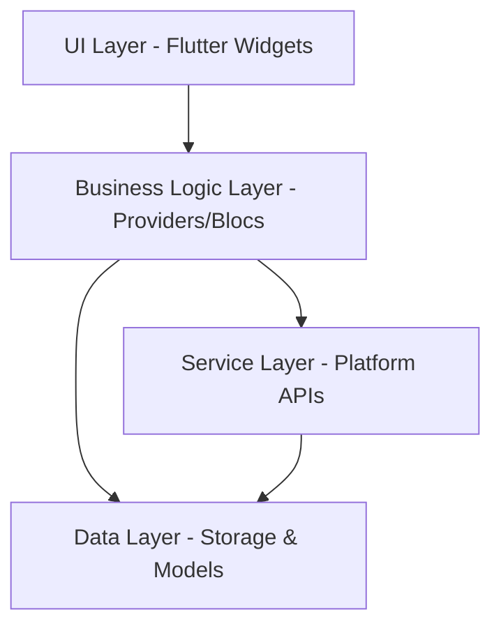

# Design Document

## Overview

The Multi-Platform Poster is a Flutter desktop application for Ubuntu/Linux that provides a unified interface for posting to Mastodon, Bluesky, and Nostr. The application follows a clean architecture pattern with clear separation between UI, business logic, and data layers. The design emphasizes security, user experience, and maintainability.

## Architecture

### High-Level Architecture



### Core Components

- **UI Layer**: Flutter widgets with responsive design and theme support
- **State Management**: Provider pattern for reactive state management
- **Service Layer**: Platform-specific API clients for each social media service
- **Data Layer**: Secure storage for credentials and app preferences
- **System Integration**: System tray and native OS integration

## Components and Interfaces

### 1. Main Application Structure

```dart
// Core app structure
class MultiPlatformPosterApp extends StatelessWidget
class MainWindow extends StatefulWidget
class SystemTrayManager
class ThemeManager extends ChangeNotifier
```

### 2. Platform Services

```dart
// Abstract base for all platform services
abstract class SocialPlatformService {
  Future<bool> authenticate(AccountCredentials credentials);
  Future<PostResult> publishPost(String content, Account account);
  Future<bool> validateConnection(Account account);
  String get platformName;
  int get characterLimit;
}

// Concrete implementations
class MastodonService extends SocialPlatformService
class BlueskyService extends SocialPlatformService
class NostrService extends SocialPlatformService
```

### 3. Account Management

```dart
class Account {
  String id;
  String platformType;
  String displayName;
  String username;
  Map<String, dynamic> credentials;
  bool isActive;
}

class AccountManager extends ChangeNotifier {
  Future<void> addAccount(Account account);
  Future<void> removeAccount(String accountId);
  Future<void> updateAccount(Account account);
  List<Account> getAccountsForPlatform(String platform);
}
```

### 4. Post Management

```dart
class PostManager extends ChangeNotifier {
  Future<PostResult> publishToSelectedPlatforms(
    String content,
    Set<String> selectedPlatforms,
    Map<String, Account> selectedAccounts
  );

  bool canPost(String content, Set<String> platforms);
  int getCharacterLimit(Set<String> platforms);
}

class PostResult {
  Map<String, bool> platformResults;
  Map<String, String> errors;
  bool get hasErrors;
  bool get allSuccessful;
}
```

### 5. UI Components

```dart
// Main posting interface
class PostingWidget extends StatefulWidget
class PlatformSelector extends StatefulWidget
class AccountSelector extends StatefulWidget

// Settings interface
class SettingsWindow extends StatefulWidget
class AccountSettingsTab extends StatefulWidget
class ThemeSettingsTab extends StatefulWidget

// System tray
class TrayIconManager
class TrayContextMenu
```

## Data Models

### Account Model
```dart
class Account {
  final String id;
  final PlatformType platform;
  final String displayName;
  final String username;
  final DateTime createdAt;
  final bool isActive;

  // Platform-specific data stored securely
  Map<String, dynamic> get credentials;
}
```

### Platform Configuration
```dart
class PlatformConfig {
  final PlatformType type;
  final String apiBaseUrl;
  final int characterLimit;
  final List<String> requiredCredentialFields;
  final AuthenticationType authType;
}
```

### Application Settings
```dart
class AppSettings {
  final ThemeMode themeMode;
  final bool minimizeToTray;
  final bool startMinimized;
  final Map<PlatformType, String> defaultAccounts;
  final bool autoSaveContent;
}
```

## Error Handling

### Error Types
```dart
enum PostError {
  networkError,
  authenticationError,
  rateLimitError,
  contentTooLong,
  platformUnavailable,
  unknownError
}

class PlatformException implements Exception {
  final PlatformType platform;
  final PostError errorType;
  final String message;
  final dynamic originalError;
}
```

### Error Handling Strategy
- **Network Errors**: Retry mechanism with exponential backoff
- **Authentication Errors**: Prompt for re-authentication
- **Rate Limiting**: Queue posts and respect platform limits
- **Partial Failures**: Continue posting to successful platforms
- **User Feedback**: Clear, actionable error messages

## Testing Strategy

### Unit Tests
- **Service Layer**: Mock API responses for each platform
- **Business Logic**: Test posting logic, account management
- **Data Models**: Validation and serialization tests
- **Utilities**: Theme management, credential encryption

### Integration Tests
- **API Integration**: Test actual API calls with test accounts
- **Storage Integration**: Test secure credential storage/retrieval
- **Cross-Platform**: Test system tray functionality

### Widget Tests
- **UI Components**: Test widget rendering and interactions
- **State Management**: Test provider state changes
- **Navigation**: Test settings window and dialog flows

### End-to-End Tests
- **Complete Workflows**: Test full posting workflow
- **Account Management**: Test adding/removing accounts
- **Theme Switching**: Test light/dark mode transitions
- **System Tray**: Test minimize/restore functionality

## Security Considerations

### Credential Storage
- Use `flutter_secure_storage` for encrypted credential storage
- Integrate with Linux keyring (libsecret) for system-level security
- Never store credentials in plain text or shared preferences
- Implement credential rotation for supported platforms

### API Security
- Use HTTPS for all API communications
- Implement proper OAuth 2.0 flows for Mastodon and Bluesky
- Secure key generation and storage for Nostr
- Validate SSL certificates and implement certificate pinning

### Application Security
- Sanitize user input to prevent injection attacks
- Implement rate limiting to prevent abuse
- Log security events without exposing sensitive data
- Regular security dependency updates

## Platform-Specific Implementation Details

### Mastodon Integration
- **Authentication**: OAuth 2.0 with PKCE
- **API**: REST API v1/v2 endpoints
- **Character Limit**: 500 characters (configurable per instance)
- **Media Support**: Images, videos (future enhancement)

### Bluesky Integration
- **Authentication**: AT Protocol authentication
- **API**: AT Protocol XRPC methods
- **Character Limit**: 300 characters
- **Handle Resolution**: Support for custom domains

### Nostr Integration
- **Authentication**: Public/private key pairs (NIP-01)
- **Protocol**: WebSocket connections to relays
- **Character Limit**: No inherent limit (reasonable UI limit)
- **Relay Management**: Support multiple relay connections

## System Tray Implementation

### Linux System Tray
- Use `system_tray` or `tray_manager` Flutter package
- Implement StatusNotifierItem for modern Linux desktops
- Fallback to legacy system tray for older environments
- Context menu with Open, Settings, and Quit options

### Window Management
- Hide to tray instead of closing when window is closed
- Restore window position and size on reopen
- Support for always-on-top mode (optional)
- Keyboard shortcuts for quick access

## Theme System

### Theme Implementation
- Material Design 3 theming with custom color schemes
- Support for system theme detection
- Smooth transitions between light and dark modes
- Consistent theming across all UI components

### Theme Persistence
- Store theme preference in secure storage
- Apply theme immediately on app startup
- Support for automatic theme switching based on time
- Custom accent color support (future enhancement)